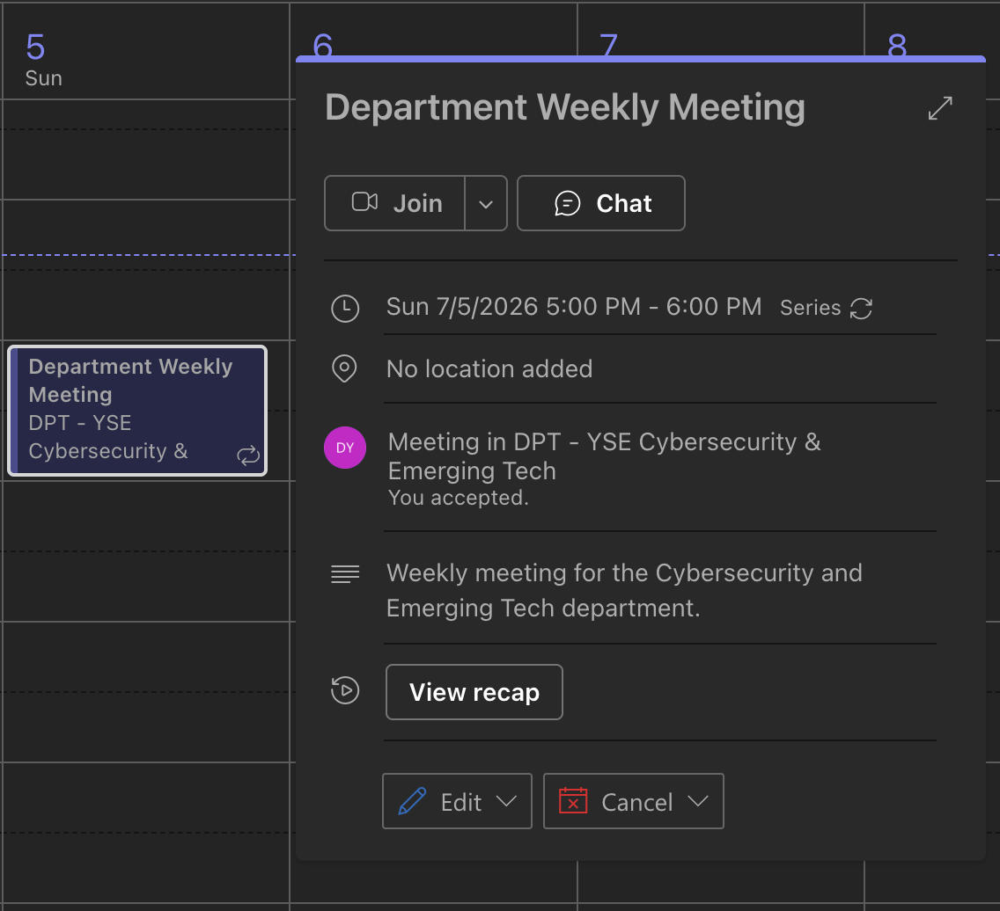
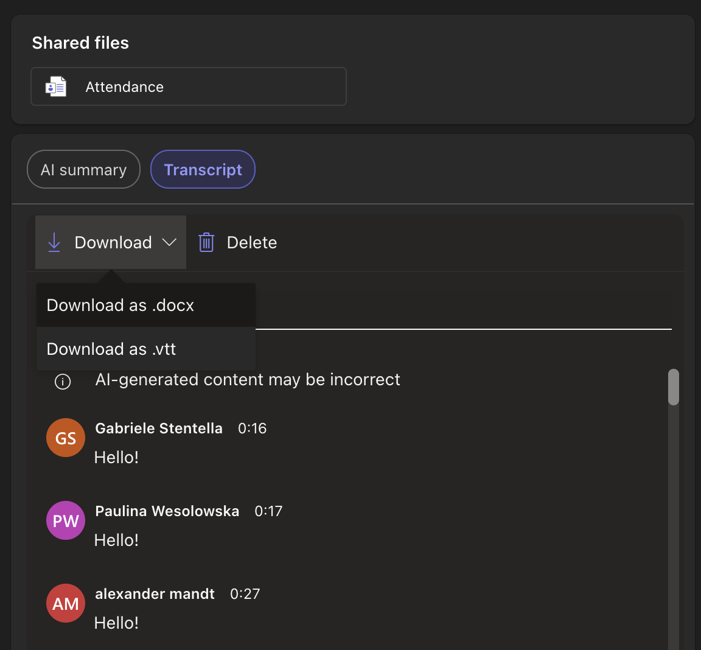
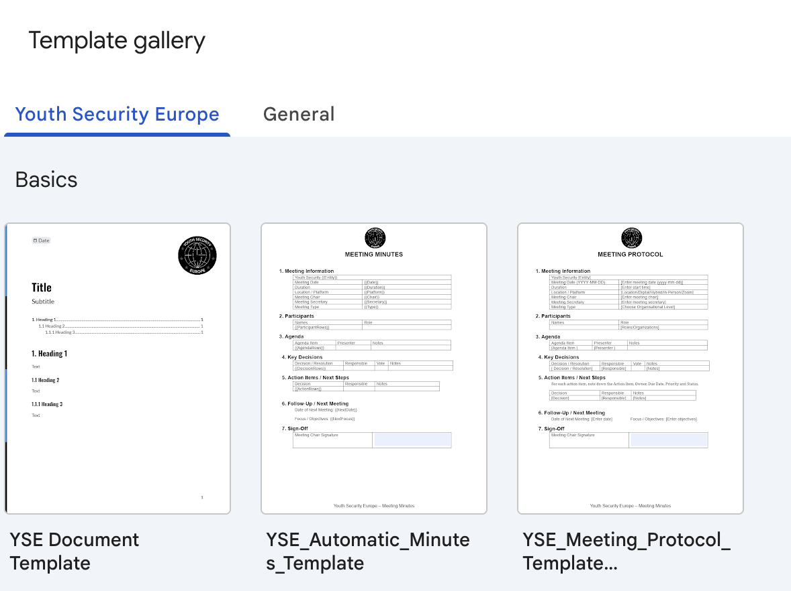
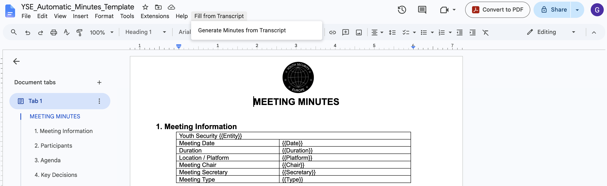
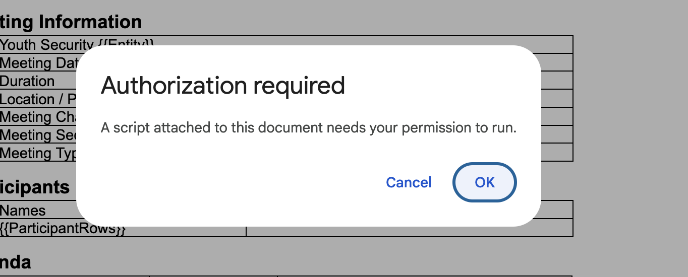
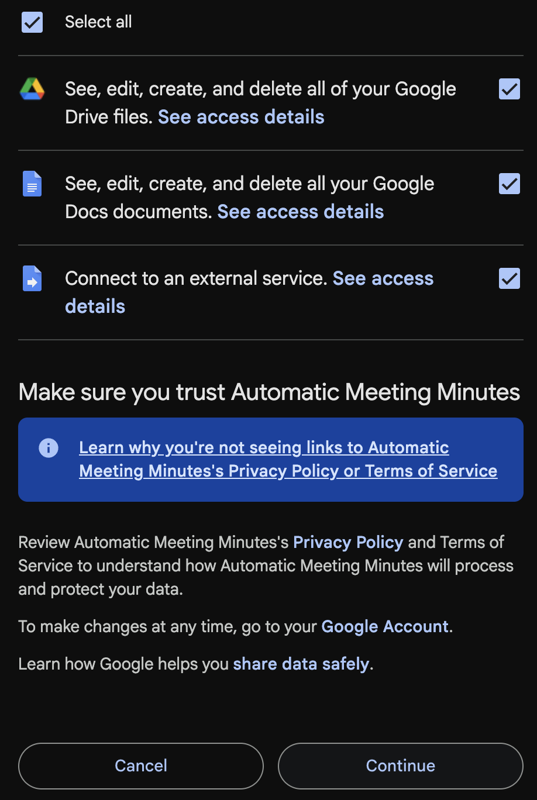
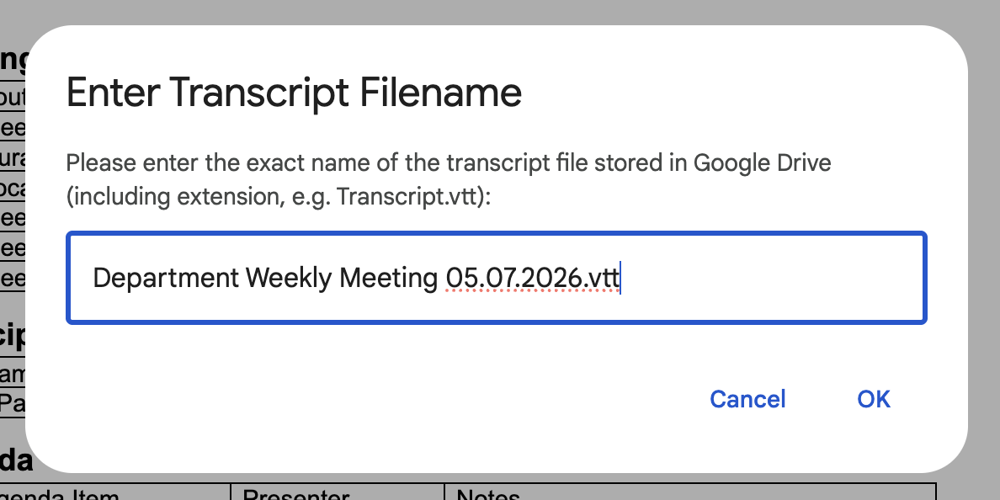

# Automating Meeting Minutes from Transcripts

**Audience:** All YSE staff and volunteers  
**Last updated:** July 2026

---

!!! warning "Beta Version Disclaimer"
    This automation tool is currently in **beta**. Please do not rely exclusively on the automatically generated meeting minutes. Always review and verify the output for accuracy and completeness before final distribution. If you encounter any bugs or have feedback, please submit them to the IT admin at **support@youthsecurity.org**.

---

This guide explains how to use the YSE Google Apps Script to automatically generate and fill in meeting minutes starting from an MS Teams meeting transcription.

---

## Step 1: Download the Transcript from Microsoft Teams

After your meeting in Microsoft Teams ends, you need to download the transcription file.

1.  Open MS Teams and go to the meeting chat or the calendar event.
2.  Click on the **View recap** button or tab at the top of the meeting area.

    > 

3.  Go to the **Transcript** tab, click **Download**, and choose the file format (downloading as a `.docx` or `.vtt` file is recommended).

    > 

---

## Step 2: Upload the Transcript to Google Drive

Before the Google Doc script can access the transcript, the file must be uploaded to your Google Drive.

1.  Open your [Google Drive](https://drive.google.com).
2.  Upload the downloaded transcript file to your drive.
3.  Note the **exact filename** of the uploaded transcript, including its extension (for example, `meeting_transcript.docx` or `transcript.vtt`). You will need to enter this name exactly as-is later.

---

## Step 3: Create a Document from the YSE Template

The automation script is built directly into our organization's Google Docs templates.

1.  Go to [Google Docs](https://docs.google.com).
2.  Click on **Template Gallery** in the top right to expand the templates available for Youth Security Europe.
3.  Choose the template named **YSE_Automatic_Minutes_Template**.

    > 

---

## Step 4: Run the Minutes Generator Script

Once your new document is created from the template, you will see a custom menu option in the top toolbar.

1.  In the top menu bar, click on **Fill from Transcript** -> **Generate Minutes from Transcript**.

    > 

2.  **Authorize the Script (First-time only):**
    *   An "Authorization Required" prompt will appear. Click **Continue**.

        > 

    *   Select your YSE Google account, review the requested permissions, and click **Allow** to authorize the script.

        > 

3.  **Enter the Transcript Filename:**
    *   After authorization, an input box will appear.
    *   Type the exact filename of the transcript file you uploaded to Google Drive in Step 2, including the file extension (e.g., `meeting_transcript.docx`).

        > 

4.  **Confirm and Wait:**
    *   You will see an initial confirmation popup stating that the script is executing. Click **OK** on this prompt.
    *   **Do not close or refresh the browser window** while the script runs in the background.
    *   Once execution completes, a success message will appear, and the document will automatically fill in with the meeting details, summary, and action items extracted from the transcript.

---

## Video Walkthrough

The following recording demonstrates the complete Google Docs workflow, from selecting the template to running the script:

<video src="../../assets/videos/screen-recording-automatic-minutes.mp4" controls width="100%" style="border-radius: 8px; margin: 15px 0; box-shadow: 0 4px 12px rgba(0,0,0,0.15);"></video>

---

*If you experience any errors (such as file not found or authorization failures), double-check that the file name is written exactly as it appears in Google Drive, and that the file is located in your main Drive folder. For further assistance, contact **support@youthsecurity.org**.*
