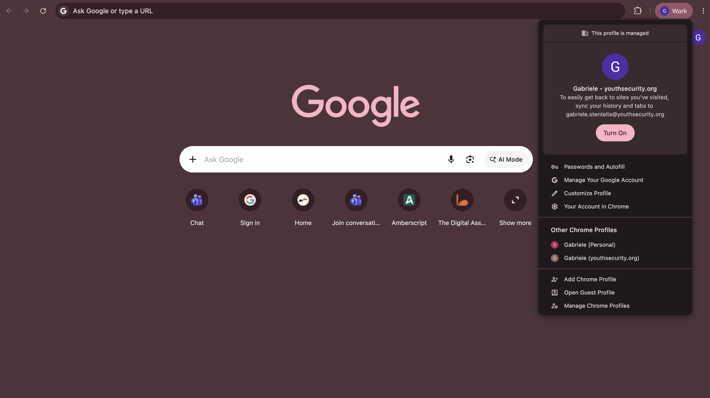
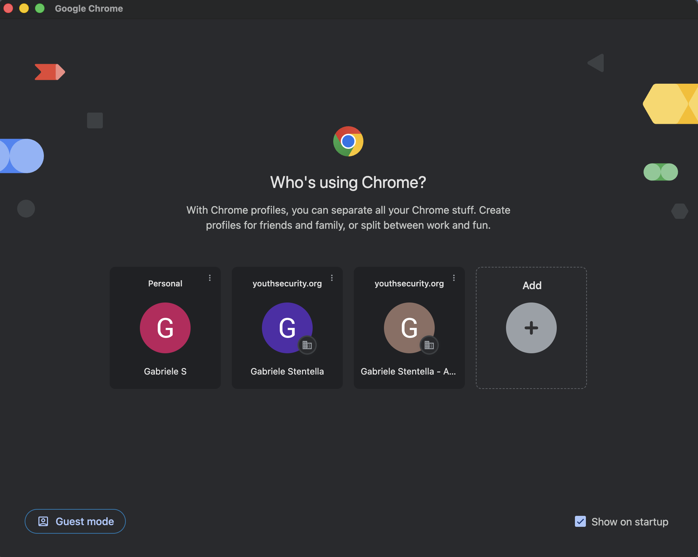

# Browser Separation: Using Chrome Profiles

**Audience:** All YSE staff and volunteers  
**Last updated:** July 2026

---

## Why Separate Work and Personal Browsing?

Many of us use the same computer for both personal tasks and Youth Security Europe (YSE) work. However, logging into personal and work Google accounts within the same browser window can cause significant issues:

*   **Session Mix-ups:** You click a link to a YSE Google Doc or Calendar event and get an "Access Denied" error because Chrome default-selected your personal Google account.
*   **Data Leaks & Syncing:** Your personal bookmarks, history, and passwords get mixed up with YSE work credentials, or vice versa.
*   **Security Vulnerabilities:** Browser extensions installed for personal use (e.g., shopping assistants, games) might monitor or access sensitive organizational data in your work tabs.
*   **Privacy Concerns:** Keeping your personal search history and accounts completely isolated ensures your privacy is protected.

### The Solution: Chrome Profiles

A **Chrome Profile** acts like a completely separate browser instance on your computer. Each profile has its own isolated:

*   Bookmarks and history
*   Saved passwords
*   Browser extensions
*   Active login sessions

By setting up a dedicated profile for your YSE Google account, you can keep work and personal life completely separate.

---

## How to Set Up Your YSE Chrome Profile

Follow these steps to create a dedicated profile for your organization Google account.

### Step 1: Open the Profile Menu

1. Open Google Chrome.
2. In the top-right corner of the window, click on the **Profile picture** (avatar icon), which is located immediately to the left of the three vertical dots (⋮).
3. A dropdown menu listing your current Chrome profiles will appear. Scroll to the bottom and click the **`Add Chrome Profile`** button.

> 

---

### Step 2: Choose to Sign In

Chrome will open a new window asking you to set up your profile.

1. To ensure your YSE bookmarks and settings are synced and protected, click the blue **`Sign in`** button.
2. *Do not* select "Continue without an account", as this will create a temporary local profile that won't save your settings across devices.

> 

---

### Step 3: Enter Your YSE Credentials

1. In the Google sign-in window that opens, enter your YSE email address (e.g., `yourname@youthsecurity.org`).
2. Click **Next**.
3. Enter your password.

---

### Step 4: Confirm Data Link and Sync

Because your account is managed by YSE, Chrome will display two confirmation prompts. These are important for organization compliance:

1. **Link your Chrome data?** Chrome will ask if you want to link your existing data to this account. Click **Link data**. This allows YSE's IT policies (such as Safe Browsing protections) to apply to your work session.
2. **Turn on sync?** Chrome will ask if you want to sync passwords, bookmarks, and history. You can choose if you want them synced between your devices, in that case click **Yes, I'm in**.

---

### Step 5: Choose a Distinct Theme Color (Recommended)

After signing in, Chrome will prompt you to pick a theme color for this profile.

*   **Tip:** Choose a color that is visibly distinct from your personal browser.
*   The title bar of your Chrome window will display this color, making it easy to identify at a glance which profile you are using.

---

## Working with Profiles: Best Practices

Now that your profile is set up, here is how to use it effectively:

### 1. How to Switch Profiles

You can switch between your personal and work profiles at any time:

*   Click the **Profile picture** in the top-right corner of Chrome.
*   Select your other profile from the list.
*   A new, separate browser window will open for that profile.

### 2. Dock / Taskbar Shortcuts

When you have both profiles open, you will see two separate Chrome icons in your computer's Dock (macOS) or Taskbar (Windows).

*   Each icon will display the profile's specific avatar.
*   You can right-click the YSE Chrome icon and select **Keep in Dock** / **Pin to Taskbar** for quick access.

### 3. Keep a Strict Boundary

*   **In your YSE Profile:** Only access work resources, sign into work-related accounts (e.g., Microsoft Teams, YSE Google Workspace), and save work bookmarks.
*   **In your Personal Profile:** Keep your personal social media, personal email (e.g., `@gmail.com`), shopping, and personal accounts here.

---

*If you experience any issues setting up your Chrome profile or logging in, contact the IT admin at **support@youthsecurity.org**.*
