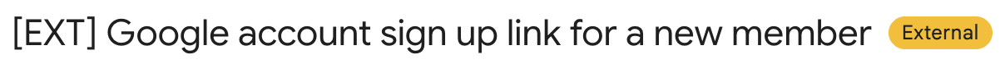

# Phishing Awareness Guide

**Audience:** All YSE staff and volunteers  
**Last updated:** June 2026

---

## What Is Phishing?

Phishing is a type of cyberattack where an attacker sends a fraudulent message, usually an email, designed to trick you into revealing sensitive information (passwords, personal data) or into clicking a malicious link or attachment.

As a security-focused NGO, YSE is an attractive target. Attackers may impersonate donors, partner organizations, government agencies, or even colleagues to gain access to our accounts, contacts, or funds.

---

## YSE-Specific Indicators in Gmail

Our Google Workspace is configured with two automatic safeguards that help you immediately identify external senders. **These are your first line of defense.**

### 1. The `[EXT]` Subject Prefix

Any email arriving from an address **outside** the YSE organization is automatically tagged with `[EXT]` at the beginning of the subject line.

**What to look for:**

```
[EXT] Your invoice is attached: please review
[EXT] Invitation: YSE board meeting
[EXT] Urgent: action required on your account
```

!!! warning "Missing `[EXT]`? Be suspicious."
    If someone claims to be writing from an external organization (e.g., a partner NGO, a funder, or a government body) but the subject line does **not** start with `[EXT]`, the message may be **spoofing** an internal YSE address. Contact the apparent sender through a separate, verified channel before taking any action.

  
> ![Gmail inbox showing [EXT] prefix](../assets/images/ext-prefix-inbox.png)

---

### 2. The Gmail "External" Warning Banner

When you **open** an email from outside the organization, Gmail displays a prominent **"External"** label or banner near the subject's name. This is a Google Workspace feature enabled by your admin.

!!! info "The banner is normal, but it demands attention."
    Seeing the "External" banner is expected for any email from a partner, donor, or external contact. Its job is to remind you to pause and verify before acting.


> 

---

## Inspect the Sender Address

Display names can be forged trivially. Anyone can set their display name to "Google Support" or "YSE Finance Team." Always check the **actual email address**.

**How to check in Gmail:**

1. Open the email.
2. Click on the sender's display name to expand the full sender details.
3. Look at the address in angle brackets (e.g., `Google Support <support-noreply@verify-account-security.com>`).

!!! danger "Red flag: display name ≠ email domain"
    | Display name | Actual address | Verdict |
    |---|---|---|
    | Google | noreply@google.com | Likely legitimate |
    | Google | support@g00gle-alerts.com | **Phishing** |
    | YSE Director | director@youthsecurity.org | Likely legitimate |
    | YSE Director | youthsecurity.director@gmail.com | **Suspicious** |

Pay attention to:

- **Lookalike domains:** `youthsecurity.org` vs `youthsecuriti.org`, or substituted characters (`0` for `o`, `1` for `l`). Or domains we don't control: currently we only control `youthsecurity.org` and `youthsecurity.org`, if you see `youthsecurity.com` that's NOT us.
- **Free email providers** for institutional senders: a real grant foundation will not email you from `@gmail.com` or `@yahoo.com`.
- **Subdomains used to mislead:** `paypal.com.verify-now.net`: the actual domain here is `verify-now.net`, not `paypal.com`.

---

## Common Red Flags

### Urgency and Pressure

Attackers want you to act before you think. Watch for language like:

- *"Your account will be suspended in 24 hours"*
- *"Immediate action required"*
- *"Confirm your identity or lose access"*
- *"Wire transfer must be completed today"*

!!! tip "Pause before you act."
    Legitimate services do not demand instant action via email. If you feel rushed, that is a deliberate manipulation tactic. Slow down.

---

### Mismatched or Generic Greetings

- **Generic:** "Dear user", "Dear customer", "Hello". A real organization that knows you uses your name.
- **Mismatched:** the email body references a service or account you do not have.

---

### Suspicious Links

Before clicking any link, **hover over it** (desktop) or **long-press** (mobile) to preview the real URL.

Ask yourself:

- Does the domain match the organization it claims to be from?
- Is there a long string of random characters, unusual subdomains, or a URL shortener (`bit.ly`, `t.co`)?
- Does a "Google login" link actually point to `accounts.google.com`, or to something else?

!!! danger "Never enter your password on a page you arrived at by clicking an email link."
    Go directly to the website by typing the address in the browser instead.

---

### Requests for Credentials or Money

No legitimate system will ever ask for your password via email. YSE IT will never ask for your Google password. Be extremely skeptical of:

- Requests to "verify" or "confirm" login credentials
- Wire transfer requests, especially if supposedly from a senior colleague
- Gift card purchases on behalf of the organization

---

### Unexpected or Password-Protected Attachments

Be cautious of:

- Attachments you were not expecting, even from known senders (their account may be compromised)
- `.zip`, `.exe`, `.iso`, `.docm`, `.xlsm` files: these can execute code
- PDF files asking you to "enable content" or "allow macros"
- Password-protected archives (the password is often given in the same email; this bypasses antivirus scanning)

---

### Grammar and Spelling Errors

Poor grammar, awkward phrasing, or inconsistent formatting can indicate a phishing attempt, though AI-generated phishing is increasingly polished. Do not rely on this signal alone.

---

## Google Workspace-Specific Phishing Tactics

Attackers know that YSE uses Google Workspace and will try to exploit that familiarity.

### Fake Google Login Pages

You receive an email saying your account has a security issue, and a link takes you to what looks exactly like the Google sign-in page. Check the URL bar: the real Google sign-in is always at `accounts.google.com`. Anything else is a fake.

### Fake "Shared Document" Notifications

A classic attack: you receive a notification that someone has shared a Google Doc with you. The notification looks authentic, but the link leads to a credential-harvesting page or a malicious file download.

!!! tip "Verify shared documents directly."
    If you receive an unexpected shared-doc notification, go to [drive.google.com](https://drive.google.com) directly (do not click the link in the email) and check if the document actually appears there.

### Google Calendar Invite Phishing

Attackers can add calendar events directly to your Google Calendar containing malicious links in the event description. If you receive an unexpected calendar invite from an unknown person with a suspicious link, decline it and report it.

---

## What To Do If You Suspect Phishing

1. **Do not click** any links, open attachments, or reply to the email.
2. **Report it in Gmail:**
   - Open the email.
   - Click the three-dot menu (⋮) in the top-right corner of the email.
   - Select **"Report phishing"**.
3. **Warn your team** if the phishing email impersonates a colleague or is targeted at YSE specifically: others may have received it too.

---

## What To Do If You Already Clicked

Act quickly; the first few minutes matter.

1. **Do not enter any credentials** if you are still on the page.
2. **Change your Google account password immediately:** go to [myaccount.google.com/security](https://myaccount.google.com/security).
3. **Review recent sign-in activity:** on the same page, check for unfamiliar devices or locations and sign out of all sessions.
4. **Check that 2-Step Verification is still enabled** on your account.
5. **Notify the IT admin immediately** at **support@youthsecurity.org**, even if you are unsure whether anything happened. Early notification dramatically limits the damage.

!!! warning "Do not delay reporting out of embarrassment."
    Phishing attacks are sophisticated and anyone can be deceived. Reporting quickly is the single most effective thing you can do to protect the organization.

---

## Quick Reference Checklist

Use this checklist whenever an email asks you to take an action (click a link, open a file, provide information, transfer money).

| Check | What to look for |
|---|---|
| **`[EXT]` prefix** | External sender? Subject should start with `[EXT]` |
| **"External" banner** | Verify the banner appears when you open the email |
| **Sender address** | Expand the sender: does the domain match the organization? |
| **Urgency or pressure** | Legitimate requests do not demand immediate action |
| **Link destination** | Hover to preview: does the URL match what is claimed? |
| **Attachment type** | Were you expecting it? Is it a risky file type? |
| **Request type** | Passwords, money, or gift cards? Never via email. |
| **Verify out-of-band** | For sensitive requests, call or message the sender separately |

---

*If you have questions about this guide or want to report a suspicious email, contact the IT admin at **support@youthsecurity.org**.*
